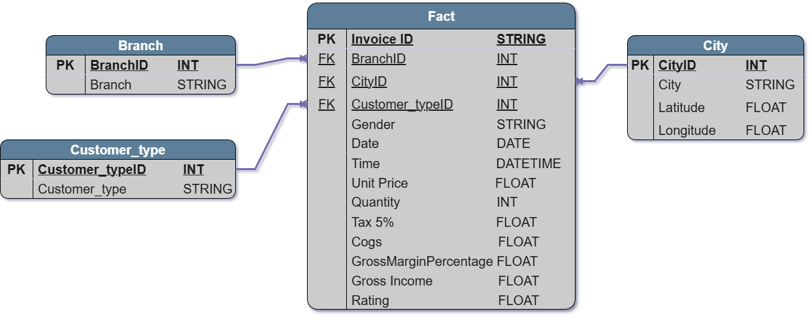

# **Exploratory, Transform and Load.**

The data is extracted with the **Pandas** library. Then some normalizartion procedure is done. And finally loaded into the *Datasets* folder.

## **Entity Relation Diagram.**

With this diagram the [1NF](https://www.freecodecamp.org/news/database-normalization-1nf-2nf-3nf-table-examples/) is ensure.

